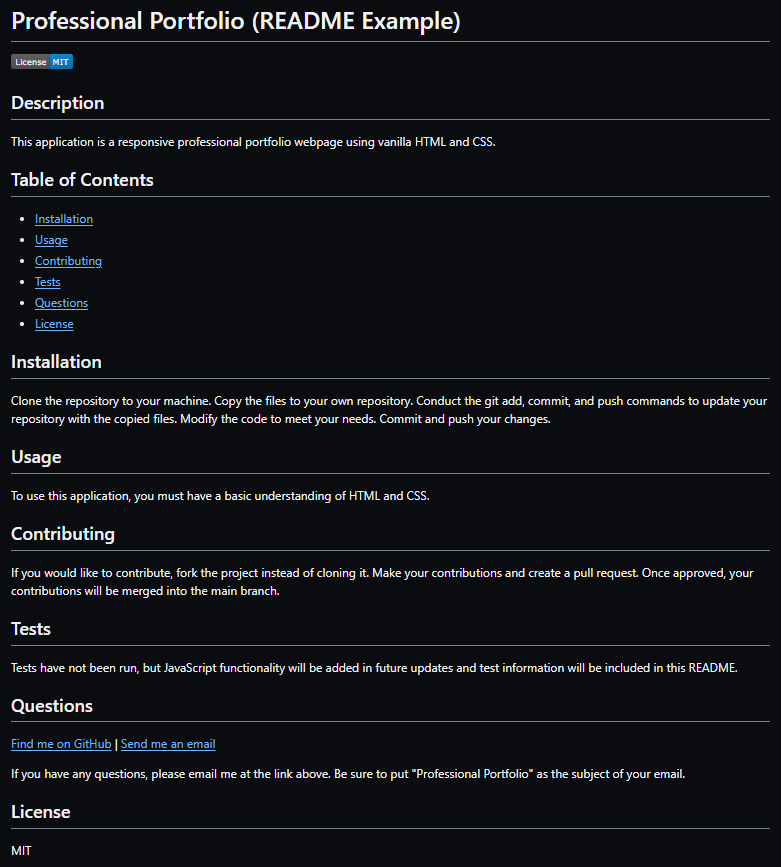

# Professional README Generator

## Description
This project involves modifying skeleton JavaScript files to bring functionality to the app. The Professional README Generator is a command line application built using JavaScript, JSON, node.js, and Inquirer. 

Once the app is initialized, users are presented with several prompts. After answering the prompts, a README file is generated using the answers provided. 

## Usage
In order to use this application, you must have node.js installed on your machine. You will also need a package.json with the required dependencies. Before installing dependencies, run "npm init" to create a package.json file. Also before installing npm dependencies, make sure you have a .gitignore file that includes node_modules/ and .DS_Store/. After running npm init, then run "npm i inquirer@8.2.4" to install inquirer. Inquirer is what allows you to execute the prompts.

To initialize the Professional README Generator, type "node index.js" in the command line. Answer the prompts and then view your new README file. Make adjustments as needed.

The image below shows an example README that was generated using the Professional README Generator.

## Installation
1. Clone the repository to your machine
2. Copy the files to your own repository
3. Conduct the git add, commit, and push commands to update your repository with the copied files
4. Modify the code to meet your needs
5. Commit and push your changes

## Links
- [GitHub Repository](https://github.com/hwoolford/professional-readme-generator) 
- [Video Overview](https://drive.google.com/file/d/12aQ34LhcWG4ekgFcNFW6GhrvZX8wZ3Lu/view?usp=drive_link)

## Acknowledgements
License badges created using [Shields.io](https://shields.io/badges/static-badge)